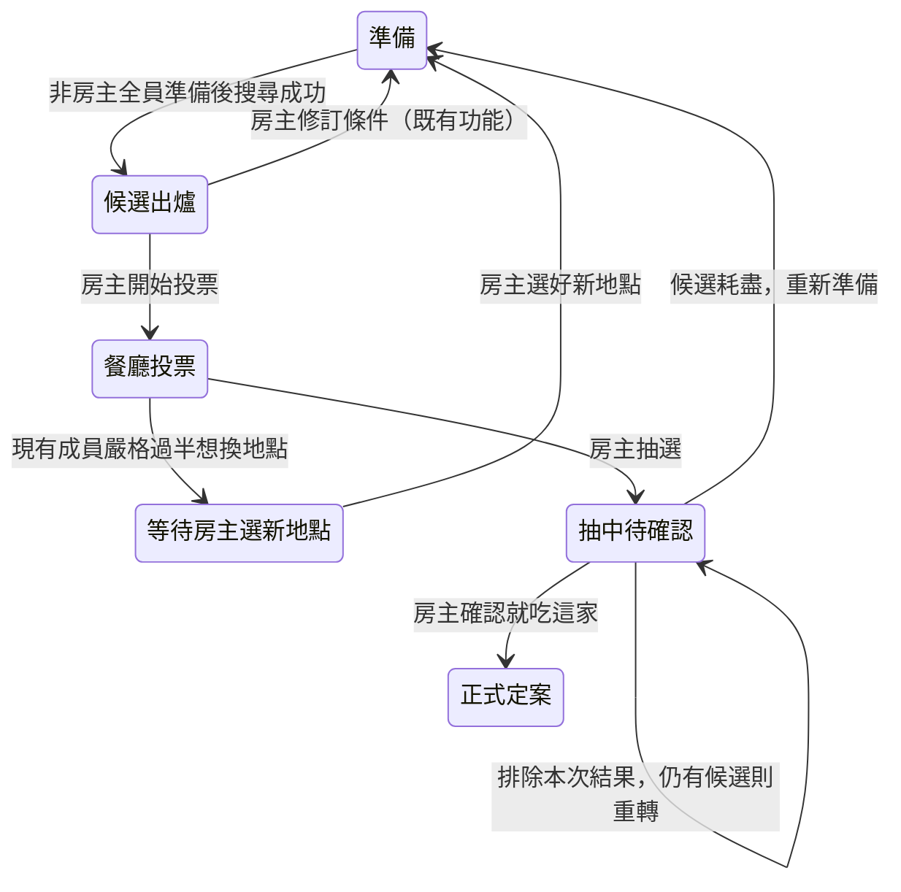

# 房間決策與免註冊入房：需求訪談

狀態：2026-09-17 使用者已授權照計劃實作，並要求新分支、逐 task 審查與 commit、每次 commit 後更新 CodeGraph；功能實作進度見 `docs/implementation-2026-09-17.md`。依 `grill-with-docs` 訪談，已確認的領域詞彙同步寫入 `CONTEXT.md`。本文區分使用者已選擇的規則與實作建議，不代表現行功能或正式環境已部署。

## 已提出的功能

1. 餐廳投票期間，另外表決是否改地點。
2. 抽到不喜歡的餐廳，可以刪掉後重轉。
3. 掃描 QR code 加入房間；首次只填暱稱，之後再詢問是否註冊。
4. 候選餐廳提供 Google Maps 連結，供成員查看評價。

## 已確認的決策

### 1. 改地點表決

- 改地點指更換搜尋中心（領域用語為「出發點」），並重新搜尋附近餐廳；不是原地換一批候選，也不是單獨換掉一家店。
- 先表決「要不要換地點」，通過後才由房主選擇新出發點；不採先選好目標地點再交付表決的流程。
- 改地點通過門檻為房內全體成員（含房主）嚴格過半同意：4 人需 3 票、5 人需 3 票；未投票不算同意。
- 投票階段持續顯示換地點意願；每位成員可勾選或收回，沒有額外發起人或倒數。未達門檻可正常投餐廳與抽選，達門檻才停止並交由房主選新地點。
- 房主選好新地點後保留個人條件，重設準備狀態；沿用房主免按準備、其他成員全數準備才可搜尋的規則，產生新候選後重新投票。
- 表決門檻依目前仍在房內的成員即時重算；退出者的意願不計入。成員退出也可能讓原有同意票達門檻。一旦通過就不撤回，房主退出則由接任房主繼續選地點。

### 2. 排除結果並重轉

- 抽選增加「抽中待確認 → 確認就吃這家 → 正式定案」流程。待確認時可排除剛抽中的餐廳並重轉；只把最後確認的餐廳計入用餐紀錄與定案用餐的公平計算，正式定案後不可重轉。
- 「排除這家並重轉」與「確認就吃這家」都只有房主能操作，其他成員觀看同步結果。
- 被放棄的餐廳只在目前這批候選中持續排除；同批重轉不再抽到，重新搜尋後重置，不影響其他房間與歷史紀錄。稱為「本批排除」，不刪除餐廳主資料。
- 最後一家也被排除時，保留房間、邀請碼、成員與條件，回準備階段；房主可保留或修改地點，非房主重新準備後再搜尋。
- 待確認階段停止餐廳投票與改地點表決，只開放房主正式確認或排除重轉；候選耗盡才回準備階段。

### 3. QR code 與訪客成員

- 訪客在餐廳正式定案後才收到一次可跳過的註冊提示，說明註冊可保留紀錄；同次使用跳過後不反覆提示。
- 訪客可填條件、準備、投餐廳與表決改地點，也可接任房主完成決策；建立新房須先註冊。
- QR code 僅在準備階段允許新成員加入；候選、投票與抽中待確認階段不開放新入房，回準備階段後同一 QR code 重新可用。
- 同一瀏覽器再次掃碼沿用訪客身分與暱稱；升級註冊新帳號後保留該身分的紀錄。換裝置、無痕或清除瀏覽資料後視為新訪客，跨裝置延續須先註冊。
- 第一版不合併訪客與既有正式帳號。登入既有帳號前須先退房並明確告知訪客紀錄不會合併；既有帳號的房籍與歷史保持原樣。

### 4. 候選餐廳 Google Maps 連結

- 只在仍可抽選的 Google 來源候選上顯示「在 Google Maps 查看」，被排除的餐廳不顯示。
- 開啟店家資訊頁即可，由使用者在 Google Maps 查看評價，不要求直接落在評論分頁。
- 以新分頁或系統的 Maps App 開啟，保留房間頁；模擬餐廳不提供假店家連結。

## 最後確認事項

使用者已確認按本計劃執行。下列流程銜接、失敗處理與驗收情境納入實作範圍。

## 流程與銜接建議

- 階段名稱為設計用語，實際資料庫狀態命名留待實作；`decided` 始終是不可重開的終態。
- 選點成功返回準備階段時，清除舊候選、餐廳票與改地點意願、待確認結果及本批排除；保留房間、邀請碼、成員、個人條件與既有歷史。重新搜尋產生新候選，不沿用舊票。
- 等待選新地點期間禁止搜尋、抽選及新入房；完成選點才開放準備與新入房。房主取消選點視窗不撤銷已通過的表決，仍停留等待選點。
- 重轉繼續使用既有評分方式，依現任成員及有效候選重新計算機率；本批排除不得被一般重算或退房恢復，也不消耗成員的否決額度。每次抽選留下可重放的結果與機率快照，僅正式確認寫入用餐紀錄。
- 待確認期間仍可退房；沿用最早加入者繼任及最後一人退房刪房的規則。確認與重轉均由伺服器核對最新房主、階段及結果版本，防止舊畫面確認了新結果。
- QR code 使用含邀請碼的站內 hash 入房連結，沿用部署路徑；同時保留邀請碼與可複製連結。用手機系統相機掃描即可，不另建 App 內掃描器。
- 已登入者掃碼沿用既有身分；已有同房房籍者直接回房間。若仍在另一房，先沿用離席確認，取消就保留原房，不靜默退房或換身分。
- 暱稱沿用既有非空、最多 80 字的驗證，不用暱稱辨識或合併身分。跳過註冊提示後仍提供註冊入口；「同次使用」以目前瀏覽器訪客登入持續期間為界，不因頁面重新整理再次提示。

## 失敗與併發處理建議

1. **改地點與抽選同時送出**：以同房交易鎖序列化。先成功的狀態轉換生效，後到且階段不符的操作回報狀態已更新，不得同時產生待確認結果與已通過改地點。
2. **選點／重搜失敗或零候選**：保留房間與條件，停在等待選點或準備階段，顯示原因並提供手動再試；不恢復舊票、不自動無限重搜。選點期間的舊搜尋回應不得覆蓋新地點結果。
3. **連點、重送與斷線**：排除重轉與正式確認必須綁定所見結果版本；同一重轉請求不得連續排除兩家，同一確認不得多寫用餐紀錄。重新連線讀取伺服器權威階段與結果。
4. **待確認餐廳失效**：確認前再次驗證硬性條件；失效則拒絕定案，提示房主重轉，沒有可用候選則返回準備。不得把已失效餐廳記成正式決策。
5. **掃碼、註冊失敗**：失效邀請不建立房籍；匿名登入或入房錯誤保留已填暱稱並顯示手動重試。升級失敗維持訪客身分與房內資料；email 尚未驗證時不宣稱已完成註冊。既有帳號切換的退房失敗則留在原房，不先登出。

## 現有實作與需修訂的邊界

以下於 2026-09-17 由本機程式碼與文件核對；不代表正式環境配置已驗證。

| 範圍 | 現行行為與依據 | 新需求的影響 |
| --- | --- | --- |
| 改條件 | `docs/adr/0004-single-use-rooms.md`、`server/handlers.go`：房主只能在候選階段返回等待中，清候選並重設準備狀態。 | 投票中的改地點需要新的明確規則。 |
| 抽選與定案 | `server/handlers.go` 的 `handleDraw`：抽選交易直接進入 `decided`、保存唯一房間抽選結果並呼叫 `RecordDecision`。 | 重轉不能只重播轉盤；需先定義何時真正定案，避免把被放棄的餐廳計入用餐紀錄。 |
| 一次性房間 | ADR-0004 明定已定案房間不重開。 | 已選擇新增「抽中待確認」；正式定案終態不改，見 ADR-0008。 |
| 身分與入房 | `web/src/App.tsx`：無 session 導向登入；`supabase/config.toml` 關閉匿名登入；`join_room` 僅允許等待中的房間。 | 首次只填暱稱需設計訪客身分與入房入口，不只是加 QR code。 |
| 註冊驗證 | `server/signup_email.go` 的 hook 會驗證簽章後，對 `user.email` 一律執行 Regex 與 DNS MX 檢查。 | 若採匿名 Auth，需驗證無 email 的訪客建立流程及日後綁定 email 的驗證時點；不能直接啟用匿名登入就宣稱完成。 |
| 地圖 | `CandidateList.tsx` 尚無地圖連結；`ResultCard.tsx` 使用 `buildMapsUrl` 提供目的地導航。 | 候選查看店家資訊的入口需與結果導航區分；維持導航不指定起點的既有契約。 |
| 搜尋圓心 | `server/freeze.go` 假設建房後圓心不可變，檢索後的交易不重查圓心。 | 新增改地點後需重查搜尋版本與圓心；只補 UI 會留下舊地點結果覆蓋新地點的風險。 |

## 預計修改範圍與驗證方法

| 工作 | 主要檔案／模組 | 必須證明的行為 |
| --- | --- | --- |
| 房間流程 | `server/handlers.go`、`vote.go`、`leave.go`、`freeze.go`、`rescore.go`、`db.go`；新增 migration | 門檻、階段、權限、結果版本、重轉排除與只記錄最後定案的交易一致性；Go tests + 真實測試 DB 的交易／併發測試。 |
| 房間畫面 | `web/src/pages/RoomPage.tsx`、`hooks/useRoom.ts`、`lib/types.ts`、`lib/api.ts`、`components/Wheel.tsx`、`ResultCard.tsx`、離席提示 | 多人同步、按鈕權限、每次新抽選的動畫、無候選出口；Vitest + 多瀏覽器 session 的 Playwright。 |
| 訪客與 QR code | `web/src/App.tsx`、`pages/AuthPage.tsx`、`pages/HomePage.tsx`、入房入口、`server/signup_email.go`、Auth 設定、建房 RPC 授權 | 首次只填暱稱、同 session 恢復、訪客不能建房、可繼任、升級不換身分、舊帳號不合併；RLS／RPC 測試 + Auth 整合測試。 |
| 地圖入口 | `web/src/components/CandidateList.tsx`、`lib/maps.ts` 與既有測試 | 僅可抽選 Google 餐廳有正確店家連結，被排除與 mock 不顯示，結果導航不受影響。 |
| 文件與部署 | `CONTEXT.md`、ADR-0004/0005/0007 的相容說明、ADR-0008/0009、`docs/deploy.md` | 決策與實作一致；新增 migration、匿名 Auth 與 email 驗證配置有清楚啟用步驟。部署另依授權執行。 |

實作優先沿用目前 Supabase 身分、Go 集中寫入、既有選點器、評分與離席流程；僅 QR code 產生器可能需新增小型依賴，先查實際可用套件，不自行發明編碼器。保留預算滑桿 `100–1600`、step 100、`DISTANCE`、最多四次 Places 呼叫且不自動重試、成員不攜帶座標及房間圓心隱私等既有契約。

## 文件與驗證範圍

- 訪談期間只更新需求文件與已確認的詞彙；涉及既有邊界取捨時，再記錄 ADR。
- 訪談階段僅檢查文件；後續已授權功能實作、測試與分 task Git 提交。部署尚未授權。
- 完整規格已由使用者以「新開個乾淨分支後開始照計劃執行」授權。

## 官方文件核對（技術候選，非已實作）

- [Supabase Anonymous Sign-Ins](https://supabase.com/docs/guides/auth/auth-anonymous)：平台已有匿名身分與連結正式登入方式的機制；匿名身分使用 `authenticated` 權限角色，必須明確限制訪客不能建立新房。清除瀏覽資料或更換裝置不會自動恢復原匿名身分。
- 同一官方文件區分「訪客升級新帳號」與「登入既有帳號」；既有帳號的資料衝突需由產品決定，不可假設自動合併。綁定 email 與設定密碼的驗證時序需與既有 Regex + DNS MX 政策一起檢查。
- [Google Maps URLs](https://developers.google.com/maps/documentation/urls/get-started)：可用搜尋連結與 `query_place_id` 開啟指定店家資訊，符合已選的店家頁需求；不需為評論另外抓取內容。Google 來源但缺少有效識別碼時以店名與座標作搜尋 fallback，不把 mock 識別碼當 Place ID。

## 已確認規則的驗收情境（尚未執行）

### 改地點

1. 4 人房有 2 票想換地點時，餐廳投票與抽選仍可進行；第 3 票使表決通過，後續餐廳投票與抽選停止。
2. 尚未通過時，成員收回換地點意願，票數立即減少；未投票者不算同意。
3. 通過前不要求指定新地點；通過後由房主選擇新出發點。
4. 更換出發點後保留各人的條件，非房主重新確認準備；尚有非房主未準備時不得重新搜尋。
5. 4 人房已有 2 票想換地點，未同意者退出後，2/3 立即通過；若是同意者退出則剩 1/3，不通過。

### 重轉與正式定案

1. 抽中 A 尚未確認，不產生 A 的同席紀錄；房主排除 A 後抽中 B，本批後續抽選不再出現 A。
2. 重轉與確認請求來自非房主即拒絕；換房主後僅接任者可操作，包括訪客房主。
3. 確認 B 後只寫入 B 的正式用餐紀錄；已定案不可重轉，舊的已定案房間也不開放重轉。
4. 最後候選被排除時回準備階段，保留邀請碼與條件；重新搜尋後可再次出現 A，符合排除只限本批。
5. 待確認期間兩種投票均被 UI 與伺服器拒絕；重整顯示同一權威結果，不產生新抽選。

### QR code 與訪客

1. 新瀏覽器掃準備中的房間，只填有效暱稱即可入房，不要求 email、密碼或定位；開錯／失效邀請不產生房籍。
2. 同瀏覽器再次掃碼沿用身分；已在房內可直接返回，非準備階段不增加新成員。
3. 訪客可準備、投票、表決與接任房主，但直接呼叫建房 RPC 也必須被拒絕，不能只靠前端。
4. 正式定案前不自動提示註冊；定案後可跳過，同次登入重新整理不再提示。升級成功後原身分的紀錄保留，失敗時訪客可繼續使用。
5. 嘗試登入既有帳號先告知不合併並走離席確認；取消或退房失敗不切換身分，成功後不覆蓋既有帳號資料。

### Google Maps 與共通不變式

1. 只有仍可抽選的 Google 餐廳顯示連結；被否決、被硬性排除、本批排除及 mock 餐廳不顯示。
2. 有效 Place ID 指向該店資訊，缺少 Place ID 使用店名及座標搜尋；開啟後原房間頁仍保留，結果卡導航仍不帶 `origin`。
3. 改地點表決、抽選、退房、重轉與確認的競態依伺服器狀態決定，沒有雙重定案或幽靈房籍。
4. 手動重試不改寫已成功的結果；舊搜尋回應不覆蓋新圓心；本批排除不因重算復活。
5. 所有查詢、寫入維持成員與房主權限，既有硬性條件、準備凍結與隱私約束不因訪客模式或重轉失效。
