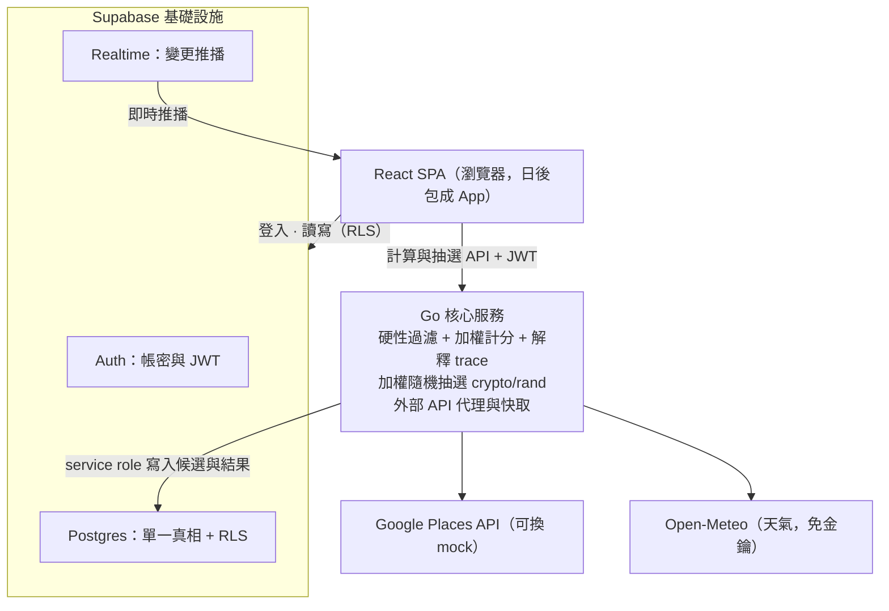

# 多人餐廳決策與公平抽選 App — 設計文件

- 日期：2026-08-05
- 狀態：已與需求方逐段確認通過；同日 grilling 修訂（過敏、群組身分、重算時機、否決語意、時間錨點、滿足度定義）
- 型態：個人 side project，無硬性 deadline，靠嚴格分期控制範圍
- 詞彙表見 [/CONTEXT.md](../../../CONTEXT.md)，重大決策見 [/docs/adr/](../../adr/)

## 1. 核心論述

本專案不是「附近餐廳搜尋」也不是「隨機轉盤」，而是一套**群組餐廳決策系統**：結合多人偏好、即時情境、長期公平性、探索機制與**可解釋機率**。每家候選餐廳的中選機率、以及它被保留/加權/降權/排除的原因，全程對所有成員透明。

可解釋性（顯示機率與原因）從 Phase 1 第一天就存在，因為它是核心論述。

## 2. 已確認的關鍵決策

| 決策點 | 結論 |
|---|---|
| 平台 | Web 優先（React SPA），日後以 wrapper（如 Capacitor）包成雙平台 App，不改寫 |
| 加入門檻 | 加入房間前必須註冊登入，無匿名訪客 |
| 技術棧 | React SPA + Supabase（Auth/Postgres/Realtime）+ Go 核心服務 |
| 即時同步 | DB 為單一真相：狀態全在 Postgres，客戶端訂閱 Supabase Realtime `postgres_changes` |
| 寫入路徑 | 混合分工：條件設定等簡單寫入由客戶端直寫 Supabase（RLS 把關）；搜尋/計分/抽選/確認**與投票**走 Go（`votes` 客戶端唯讀，見 §7 D15） |
| 抽選可信度 | 純伺服器隨機（`crypto/rand`）+ 留存 seed 與機率快照；commit-reveal 為預留升級路徑，非本期範圍 |
| 過敏處理 | 不做。飲食禁忌僅限 tag 層級可判定者，UI 無過敏欄位（[ADR-0001](../../adr/0001-no-allergen-handling.md)） |
| 群組身分 | 無群組實體。跨房間歷史一律掛在「每人同席紀錄」上（[ADR-0002](../../adr/0002-per-user-history-no-group-entity.md)） |
| 時間錨點 | 只支援「現在出發」，預約未來時段不在範圍 |
| Google Places | 申請 API key 與開發併行：Places 存取封成 provider 介面，先用內建 mock 資料，key 到手切換真 API |
| 天氣 | Open-Meteo（免費、免金鑰） |
| 導航 | 跳轉 Google Maps URL（`https://www.google.com/maps/dir/?api=1&...`），不自建導航 |

## 3. 系統架構



分工原則一句話：規則簡單的寫入走 Supabase（RLS + DB trigger 把關），需要伺服器權威的運算、或牽涉跨列不變式的寫入（投票，見 §7）走 Go；房間狀態全部落在 Postgres，由 Realtime 推給所有成員，斷線重連只要重拉一次資料即可恢復。

### Monorepo 結構

```
/web        React + Vite + TypeScript SPA
/server     Go 核心服務（引擎、外部 API、抽選）
/supabase   DB migrations、RLS policies、triggers
```

### Go API（皆需 `Authorization: Bearer <Supabase JWT>`，Go 以 JWKS 驗證後檢查 membership）

| Endpoint | 權限 | 作用 | Phase |
|---|---|---|---|
| `POST /api/rooms/{id}/search` | 房主 | 取候選 → 過濾 → 計分 → 寫入 `room_candidates`，房間 `lobby → candidates`；零候選時房間停留在 `lobby` 並回傳排除統計 | 1 |
| `POST /api/rooms/{id}/edit-conditions` | 房主 | 單一交易將 `candidates → lobby`、清空 `room_candidates`、全員 `ready=false`；保留房間、成員、邀請碼、條件與既有 `exposure_stats`。成功回 `204 No Content` | 3 |
| `POST /api/rooms/{id}/start-voting` | 房主 | 單一交易將 `candidates → voting`；與候選修訂競速時只會有一個 conditional transition 成功 | 2 |
| `POST /api/rooms/{id}/draw` | 房主 | 權威重算（含票數）→ 加權抽選 → 寫入 `draws`，房間 `→ decided` | 1 |
| `POST /api/rooms/{id}/vote` | 任一成員 | 投票/否決/收回的唯一入口（body `{restaurant_id, kind: up\|veto, op: cast\|retract}`）：單一交易內完成階段驗證 → 冪等 → 限額 → 寫票 → inline rescore；同店 up 與可收回 veto 可並存，重算後的全房機率寫回 `room_candidates`，Realtime 推給全員；轉盤上的 % 永遠是當下真實機率。無獨立 rescore endpoint（D15） | 2 |
| `GET /healthz` | 公開 | 健康檢查 | 1 |

## 4. 資料模型（Postgres）

| 表 | 關鍵欄位 | 說明 |
|---|---|---|
| `profiles` | `id`（= `auth.users.id`）、`display_name`、`default_prefs jsonb` | 預設偏好，開新房自動帶入 |
| `rooms` | `id`、`code`（6 碼邀請碼，unique）、`host_id`、`status`、`center_lat/lng`、`exploration`（`familiar/balanced/explore`，房主於 lobby 設定） | 房間即一次決策；無跨房間群組概念（ADR-0002） |
| `room_members` | `(room_id, user_id)` PK、`budget_max`（100–1600 的價位偏好刻度；非人均 TWD 保證）、`cuisines jsonb`、`dietary jsonb`（tag 層級禁忌，ADR-0001）、`max_distance_m`、`transport`（`walking/driving/transit`）、`ready` | 每位成員的條件 |
| `restaurants` | `id`、`place_id`（unique）、`name`、`cuisine_tags jsonb`、`price_level`（0–4）、`lat/lng`、`address`、`opening_hours jsonb`、`rating`、`fetched_at` | Places 快取。遵守快取條款：`place_id` 可永存，其餘欄位以 `fetched_at` 為準 30 天內刷新 |
| `room_candidates` | `(room_id, restaurant_id)` PK、`status`（`kept/excluded`）、`probability`、`weight_breakdown jsonb`、`exclusion_reason` | 每房每餐廳的機率與解釋 trace |
| `votes` | `room_id`、`user_id`、`restaurant_id`、`kind`（`up/veto`）、unique(room_id, user_id, restaurant_id, kind) | 否決是可回收的排除 overlay，不會取代同店的贊成票；否決限額 = **現存**否決數（每人每房同時最多 2 個）；voting 期間可收回（`op: retract`，由 Go 只刪 veto 列）；限額由 Go 於 vote 交易內把關（`VetoQuota`，weights.go）。既有四欄 PK 已支援此語意，無 DB migration；表僅保留宣告式 invariant（PK/CHECK/FK/成員可讀 RLS），客戶端不直寫（D15） |

投票語意（2026-08-20 修訂）：同一會員可同時保有同店 `up` 與 `veto`；veto 是可收回的排除 overlay，收回只刪 veto，不會取代或刪除 up。既有四欄 unique/PK 已支援，無 DB migration。
| `draws` | `room_id`（P1 unique：一房一抽）、`seed`、`winner_restaurant_id`、`probabilities jsonb`、`created_at` | 抽選紀錄；`seed` 留存即為 commit-reveal 升級預留 |
| `dining_history` | `id`、`user_id`、`restaurant_id`、`room_id`、`decided_at`、`rating`（nullable 1–5，餐後評分） | **每人**同席紀錄（ADR-0002）：房間 decided 時為每位成員各寫一筆；近期去過、滿足度都由它推導 |
| `exposure_stats` | `(user_id, restaurant_id)` PK、`recommended_count`、`chosen_count`、`last_chosen_at` | **每人**曝光統計：曝光平衡與新店判定的資料來源 |

前端 Realtime 訂閱：`rooms`、`room_members`、`room_candidates`、`votes`、`draws` 的 `postgres_changes`（以 `room_id` filter）。

## 5. 決策引擎（Go pipeline，六步）

1. **取候選** — 搜尋半徑 = 全員 `max_distance_m` 的**最小值**（安全交集，不會有人被迫超出可接受範圍）。Places provider 介面回傳菜系標籤、價位、營業時間。
2. **硬性過濾**（不可妥協，逐筆記中文排除原因）：
   - 任一成員 `dietary` 禁忌與餐廳 `cuisine_tags` 衝突 → 排除（tag 層級判定；系統不處理過敏，ADR-0001）
   - 任一成員的 `budget_max` 映射為可接受的最高 Google `price_level`（100–200→1、300–400→2、500–800→3、900–1600→4）；較高的已知層級排除，層級 0 與未知價位保留。這是粗略價位層級，不保證人均 TWD 價格。
   - 目前未營業 → 排除（時間錨點 = 現在，見非目標）
3. **軟性計分** — 每家從 base 1.0 開始逐因素乘倍率，同步將 `{factor, mult, reason}` 追加進 trace：

| 因素 | 邏輯（起始值，皆可調） | Phase |
|---|---|---|
| 偏好滿足 | 各成員 `cuisines` 命中率平均 → ×0.6–1.5 | 1 |
| 距離/交通 | haversine ÷ 交通方式速度估算 → 標準化 → ×0.7–1.2 | 1 |
| 即將打烊 | 60 分內打烊 ×0.6 | 1 |
| 投票加成 | 每張贊成票 +10%；否決 = 移出轉盤（現存限額，voting 期間可收回） | 2 |
| 近期去過 | 依「房內 14 天內吃過該店的成員比例」降權：全員 ×0.3、比例越低懲罰越輕（線性）；15–30 天減半計 | 2 |
| 曝光/新店 | 房內成員 `chosen_count` 聚合高者輕降權；全員 `recommended_count` = 0 小幅加成 | 3 |
| 天氣/時段 | 雨天（Open-Meteo）走路方案降權；時段與菜系匹配加成 | 3 |
| 成員公平 | 滿足度 EMA 最低的成員，其偏好倍率放大（滿足度定義見下） | 3 |

4. **探索檔位** — `rooms.exploration` 三檔（房主設定，全員可見），實作為兩個係數的 preset（近期懲罰強度、新店加成倍率）：熟悉 = 懲罰減半 + 新店加成關閉；平均 = 預設；探索 = 新店/冷門加成 ×2 + 熟店輕降。不是另一套演算法。

   P2 僅實作近期懲罰旋鈕：探索檔以**加重**近期懲罰（×1.25）近似探索行為；『新店/冷門加成 ×2 + 熟店輕降』的完整語意待 P3 曝光因素上線後回頭校準。（2026-08-06 eng review D14）

   P3 已由曝光因素取代 D14 的過渡近似，探索檔位回歸「新店/冷門加成 ×2 + 熟店輕降」的完整語意，近期懲罰不再額外 ×1.25。

5. **正規化與抽選** — `p_i = score_i / Σscore`；轉盤 UI 顯示的就是這個真實機率（%）。P2 起每次投票/否決/收回都在 `POST /vote` 的同一交易內 inline 重算（D15）。抽選前 Go 權威重算一次，`crypto/rand` 加權抽樣；`draws` 存 seed 與機率快照。
6. **可解釋性輸出** — `weight_breakdown` 範例：

```json
[
  {"factor": "preference", "mult": 1.3, "reason": "3/4 位成員偏好日式"},
  {"factor": "distance",   "mult": 0.9, "reason": "平均步行 12 分鐘"},
  {"factor": "recency",    "mult": 0.7, "reason": "2/4 位成員 22 天前吃過"}
]
```

UI 渲染為加減權 chips；被排除者顯示 `exclusion_reason`。

**滿足度（P3）**：每次房間 decided，為每位成員取「餐後評分（優先）或中選餐廳對他的偏好命中分」餵入其個人 EMA（α 起始 0.3）。餐後評分 UI 輕量且永遠可跳過。所有倍率、金額換算、時間門檻、EMA 係數集中在 `/server` 的 `weights.go` 常數檔。

## 6. 房間狀態機

```text
lobby ──房主觸發搜尋──▶ candidates ──房主開始投票──▶ voting ──房主抽選──▶ decided
  ▲                         │
  └────── 房主修改條件 ─────┘
```

- `lobby`：憑邀請碼加入（RLS 限制僅此狀態可加入）、設定條件、按 ready；搜尋零候選時停留在此
- `candidates`：全員即時看到候選清單、機率、trace chips；房主可開始投票，或確認後修改條件回 `lobby`
- `voting`（P2）：投票、否決與收回（皆走 `POST /vote`），每個動作在同一交易內重算，機率即時更新
- `decided`：顯示中選餐廳與機率快照；Google Maps 導航連結以成員自己的 `transport` 預選 travelmode；為每位成員寫入 `dining_history` 並更新 `exposure_stats`
- 只有房主能觸發搜尋、候選修訂、開始投票與抽選；`edit-conditions` 與 `start-voting` 都從 `candidates` 做 conditional update，競速時恰有一個成功，輸的請求收 409。候選修訂只清候選與 ready，不回滾 `exposure_stats.recommended_count`

## 7. 安全

- 帳密儲存：Supabase Auth（email + password，bcrypt 由平台處理）— 滿足「帳號密碼安全儲存」需求
- RLS：房間資料僅成員可讀；`room_members` 只能寫（含刪除）自己的列；**`votes` 對 authenticated 僅可讀（成員），寫入一律走 Go `POST /vote` 領域命令（單一交易：階段驗證 → 冪等 → 限額 → 寫票 → inline rescore；同店 up 與 veto 可並存）**；`rooms` 僅房主可更新（含 `exploration` 檔位，於 `lobby` 階段調整）；join 需正確邀請碼且房間在 `lobby`
  - 2026-08-06 eng review D15 修訂，取代 2026-08-05 原直寫設計（決策紀錄：[ADR-0003](../../adr/0003-centralized-vote-write-command.md)）
- Go：JWKS 驗 Supabase JWT → 查 membership → 才執行房間操作；房主限定操作再驗 `host_id`
- 金鑰隔離：Places API key 與 service role key 只存在 Go 環境變數，永不進前端 bundle
- Go endpoints 加簡易 in-memory rate limit（token bucket）

## 8. 錯誤處理

| 情境 | 行為 |
|---|---|
| Places API 失敗 | 重試一次 → fallback 用 `restaurants` 快取 → UI 標示「使用快取資料」降級提示 |
| 過濾後零候選 | 房間停留在 `lobby`，回傳全部排除原因，統計「哪個條件殺最多」並建議該成員放寬後重新搜尋 |
| 全部被否決 | 擋住抽選，提示成員收回否決（否決可收回，見 §4 votes） |
| 抽選 race / 連點 | conditional update + `draws` unique constraint，一房一抽 |
| 成員離線 | 不做 presence（P1）；狀態都在 DB，重連即恢復 |

## 9. 測試策略

重心：Go 引擎的 table-driven 單元測試。

1. 過濾規則 — 每種硬性條件的排除與保留案例
2. 因素倍率 — 每個因素的邊界值與中文 reason 產出（含近期同席比例的內插）
3. 正規化 — 機率總和 = 1（浮點誤差容許內）
4. 加權抽樣 — 大量抽樣（例：100k 次）分佈 vs 機率表的統計檢定
5. trace 完整性 — 每家餐廳必有 kept 的 breakdown 或 excluded 的原因

API 層少量 `httptest`（JWT 驗證、房間 happy path、`POST /vote` 冪等與否決限額）；前端僅對機率/chips 渲染邏輯寫一個 vitest，其餘走手動 demo script。

## 10. 部署

- `/web` → Vercel；`/server` → Fly.io 或 Railway；Supabase cloud。全部 free tier 起步。
- 本地開發：`supabase` CLI local stack + `go run` + `vite dev`。

## 11. 分期計畫

- **Phase 1（可 demo 閉環）**：註冊登入 → 建房/邀請碼加入 → 條件設定 → 硬性過濾 + 核心權重（偏好/距離/預算/營業）→ 伺服器抽選 → 轉盤顯示真實機率與加減權說明 → Google Maps 跳轉。Realtime 同步成員狀態與結果。Places 用 mock provider。
- **Phase 2（群組互動）**：投票、有限否決權（現存限額、可收回，集中寫入走 `POST /vote`）、每票於同交易內 inline 重算、探索檔位（P2 僅近期懲罰旋鈕，D14）、切換真實 Places API、交通時間細化、`dining_history`/`exposure_stats` 開始記錄、近期同席降權。
- **Phase 3（情境與長期公平）**：天氣與時段因素、曝光平衡與新店探索價值、滿足度 EMA + 餐後評分（可跳過）、長期成員公平校正、個人化偏好學習（從歷史回填 `default_prefs` 建議）。

每期結束都是可用的產品。

## 12. 非目標與預留

- 不處理過敏原：無過敏欄位、無「已排除過敏風險」暗示（ADR-0001）
- 只支援「現在出發」的即時決策；預約未來時段（含該時段的營業/天氣判定）不在範圍
- 不自建導航（跳轉 Google Maps URL）
- 不做原生 App 重寫（後期以 Capacitor 包裝）
- 不支援舊房重開：每次決策建立新房，`decided` 即為終態（ADR-0004；2026-08-10 需求方裁定）
- P1 無重抽、無 presence、無多房並行的即時公平運算（批次即可）
- commit-reveal 可驗證抽選：非本期範圍；`draws.seed` 已留存，未來加 `commit_hash` 欄位即可升級
